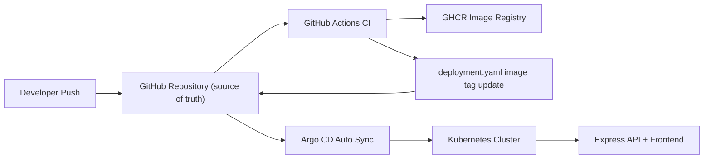

# GitOps Deployment System

This repository is a complete GitOps starter project that solves common deployment problems with a Git-centric workflow:

- Manual deployment is replaced by GitHub Actions + Argo CD automation.
- Configuration drift is reduced because Kubernetes state is defined in Git.
- Rollback is done by reverting Git commits and letting Argo CD resync.
- Visibility improves through Git history, GitHub Actions runs, Argo CD sync status, and a health endpoint.
- Environment inconsistency is minimized because every environment reads the same manifests.

## Repository layout

```text
repo/
├── app/
│   ├── backend/
│   ├── frontend/
│   ├── .dockerignore
│   ├── Dockerfile
│   └── package.json
├── argocd/
│   └── application.yaml
├── k8s/
│   ├── deployment.yaml
│   ├── namespace.yaml
│   └── service.yaml
├── .github/workflows/
│   └── ci.yml
└── README.md
```

## Application

- Backend: Node.js Express API on port `3000`
- Frontend: Static HTML/JS page served by Express at `/ui`
- API root: `GET /` returns `Hello GitOps v1`
- Health endpoint: `GET /healthz`

## Local run

Install dependencies and run the app:

```bash
cd app
npm install
npm start
```

Test locally:

```bash
curl http://localhost:3000/
curl http://localhost:3000/healthz
```

Open the UI:

- Backend root: `http://localhost:3000/`
- Frontend: `http://localhost:3000/ui`

## Docker

Build and run the container locally:

```bash
docker build -t gitops-app:local -f app/Dockerfile app
docker run --rm -p 3000:3000 gitops-app:local
```

## Kubernetes manifests

The Kubernetes manifests live in `k8s/`:

- `namespace.yaml` creates the `gitops` namespace.
- `deployment.yaml` runs `2` replicas of `gitops-app`.
- `service.yaml` exposes the app as a `NodePort` service on port `3000`.

Before deploying, replace the placeholder image in `k8s/deployment.yaml`:

```yaml
image: ghcr.io/<your-username>/gitops-app:latest
```

## GitHub Actions CI pipeline

The workflow in `.github/workflows/ci.yml` does this on every push to `main`:

1. Checks out the repository.
2. Logs in to GitHub Container Registry.
3. Builds the Docker image from `app/Dockerfile`.
4. Pushes two tags to GHCR:
   - `ghcr.io/<your-username>/gitops-app:<full-commit-sha>`
   - `ghcr.io/<your-username>/gitops-app:latest`
5. Rewrites `k8s/deployment.yaml` with the immutable SHA tag.
6. Commits the manifest change back to `main`.

Required GitHub repository secrets:

- `GHCR_USERNAME`
- `GHCR_TOKEN`

Notes:

- The workflow uses `GITHUB_TOKEN` with `contents: write` to push the updated manifest.
- The bot-generated commit does not loop forever because the job skips runs created by `github-actions[bot]`.

## Argo CD setup

Install Argo CD:

```bash
kubectl create namespace argocd
kubectl apply --server-side -f https://raw.githubusercontent.com/argoproj/argo-cd/stable/manifests/install.yaml
```

Using `--server-side` avoids the large-annotation CRD error that can happen with a normal `kubectl apply` on some clusters.

Access the UI:

```bash
kubectl port-forward svc/argocd-server -n argocd 8080:443
```

Get the initial admin password on Linux/macOS:

```bash
kubectl -n argocd get secret argocd-initial-admin-secret -o jsonpath="{.data.password}" | base64 --decode
```

Get the initial admin password in PowerShell:

```powershell
$encoded = kubectl -n argocd get secret argocd-initial-admin-secret -o jsonpath="{.data.password}"
[System.Text.Encoding]::UTF8.GetString([System.Convert]::FromBase64String($encoded))
```

Update `argocd/application.yaml` before applying it:

- Replace `https://github.com/<your-username>/gitops-app.git` with your repository URL.
- Confirm the `path` remains `k8s`.

Create the Argo CD Application after replacing the placeholder repository URL:

```bash
kubectl apply -f argocd/application.yaml
```

## Minikube or local cluster setup

Start a local Kubernetes cluster:

```bash
minikube start
```

Bootstrap the namespace once:

```bash
kubectl apply -f k8s/namespace.yaml
```

After Argo CD is installed and the Application is created, let Argo CD manage everything under `k8s/`.

Do not run `kubectl apply -f k8s/` manually for normal deployments. Git is the source of truth.

Access the application from Minikube after Argo CD syncs it:

```bash
minikube service gitops-app -n gitops --url
```

## GitOps flow

The delivery flow is:

```text
Developer pushes code
  -> GitHub Actions builds image
  -> GitHub Actions pushes image to GHCR
  -> GitHub Actions updates k8s/deployment.yaml
  -> GitHub Actions commits manifest change back to Git
  -> Argo CD detects the Git change
  -> Argo CD syncs Kubernetes automatically
```

## Rollback strategy

GitOps rollback is handled through Git history:

1. Revert the bad commit in Git.
2. Push the revert to `main`.
3. GitHub Actions builds the previous-good version again and updates `k8s/deployment.yaml`.
4. Argo CD auto-syncs the reverted manifest back to the cluster.

This gives you a traceable rollback without manual deployment commands.

## Architecture



## End-to-end setup guide

1. Create a GitHub repository and push this project to the `main` branch.
2. Set the repository secrets:
   - `GHCR_USERNAME`
   - `GHCR_TOKEN`
3. Replace placeholders:
   - `k8s/deployment.yaml`
   - `argocd/application.yaml`
4. Make the GHCR package public, or add an image pull secret if you want to keep it private.
5. Start Minikube or another local Kubernetes cluster.
6. Install Argo CD.
7. Apply `k8s/namespace.yaml` once.
8. Apply `argocd/application.yaml`.
9. Push a code change to `main`.
10. Watch GitHub Actions publish a new image and update the deployment manifest.
11. Watch Argo CD detect the Git change and deploy it automatically.

## Best-practice notes

- Git remains the single source of truth for desired cluster state.
- Argo CD automated sync with `prune` and `selfHeal` helps enforce consistency.
- The health endpoint supports basic operational monitoring and probe checks.
- Immutable image tags tied to commit SHAs improve traceability.
- No direct `kubectl apply` should be used for application changes after bootstrap.
